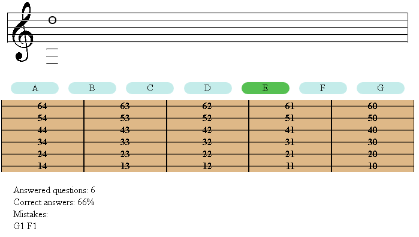

# Guitar notes test
I wrote this test to help my daughter learn notes on guitar.     
Notes staff, guitar frets, note from question and everything else rendered with CSS. The only exception is the treble clef (used picture background).      
To get correct answer you need to select what note is displayed and then click on correct string and fret on guitar to play this note.
      
This is example:     
   
         
Script uses english notes names (letters A to G) to ask question and check answer. Note drawn with `position: absolute` parameter.
        
### Test it yourself
Live version can be found [here](http://artem-soroka.tk/pages/notes/ "Guitar notes test").   
     
Thank you.